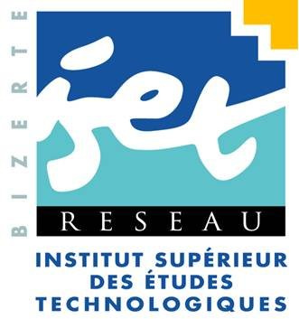

# Traitement de signal

Nous traitons essentiellement les signaux (synthèse et représentation), la convolution en 1D et en 2D, analyse spectrale et finalement le filtrage. 

Les exemples de code `Python` et `Julia` sont rajoutés pour illustrer les concepts abordés et solidifier les acquis théoriques. Chaque fichier contient des commentaires détaillés afin de faciliter la compréhension.

Les fichiers sont régulièrement mis à jour avec de nouveaux exemples et concepts. N'hésitez pas à partager, à contribuer ou à me contacter pour toute question ou suggestion.

------

